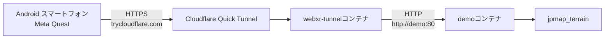
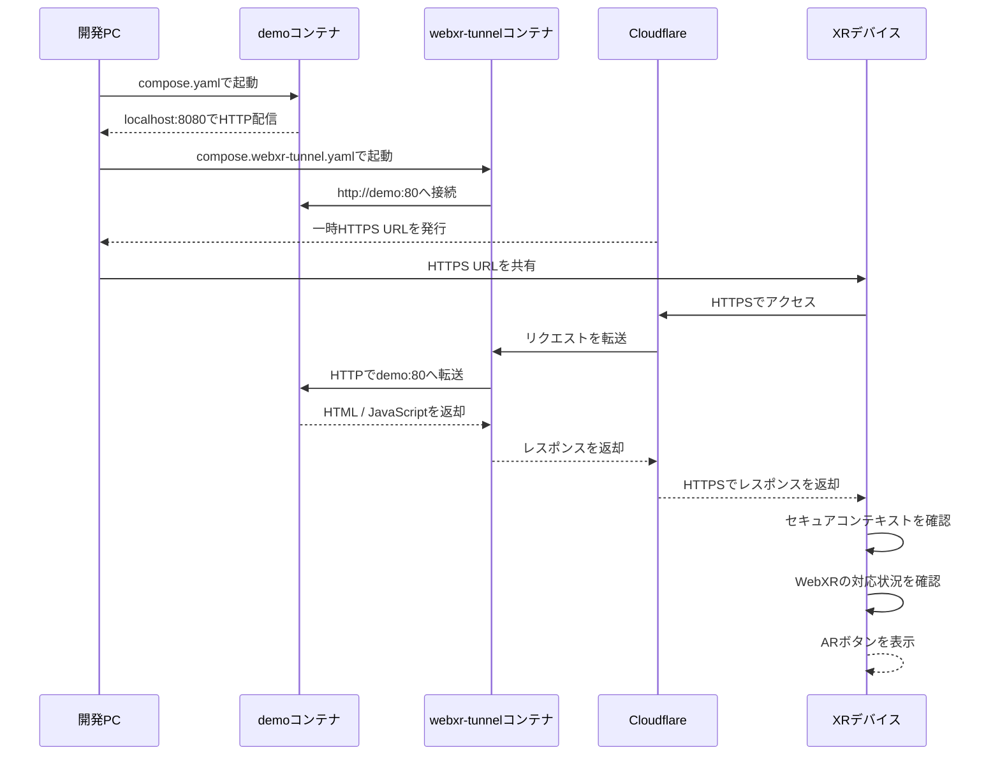

# はじめに

jpmap_terrainについては、こちらの記事で紹介しています。

https://qiita.com/8ga3/items/33c1b135fcebd3ec8107


Meta Quest 3でWebXRを実行しているところです。実はWebXRを表示するためには条件を満たす必要がありました。それは、 **セキュアコンテキスト** であること、つまりHTTPSでアクセスできる環境であることです。
しかし開発中に、ローカル環境ではHTTPSを簡単に用意できないため、WebXRが利用できないという問題に直面しました。そこで今回は、Cloudflare Quick Tunnelを使ってローカル環境をHTTPSで公開する方法を試しました。

# Cloudflare Quick Tunnelを使う

`jpmap_terrain`では、WebXRの実機検証用にCloudflare Quick Tunnelを利用できます。

構成は次のとおりです。



`compose.yaml`では、デモサイトを`demo`コンテナとして起動します。

```yaml
name: jpmap-terrain-demo

services:
  demo:
    build:
      context: ..
      dockerfile: docker/Dockerfile
    image: jpmap-terrain-demo:local
    ports:
      - "8080:80"
    restart: unless-stopped
    networks:
      - demo-net

networks:
  demo-net:
    name: jpmap-terrain-demo-net
```

ホストの8080番ポートから、コンテナの80番ポートへ接続できる構成です。

```text
http://localhost:8080
```

ただし、スマートフォンやMeta QuestからLAN内のIPアドレスでアクセスすると、通常のHTTP通信になります。

```text
http://192.168.1.10:8080
```

このURLはセキュアコンテキストではないため、WebXRを利用できない場合があります。

そこで、`compose.webxr-tunnel.yaml`でHTTPSトンネルを追加します。

```yaml
services:
  webxr-tunnel:
    image: cloudflare/cloudflared:2026.7.2
    container_name: jpmap-terrain-webxr-tunnel
    command: tunnel --no-autoupdate --url http://demo:80
    restart: unless-stopped
    networks:
      - demo-net

networks:
  demo-net:
    name: jpmap-terrain-demo-net
    external: true
```

`demo-net`を`external: true`としている点がポイントです。

先に`compose.yaml`で作成したネットワークへ、トンネルコンテナを参加させています。

# 起動手順

`docker`ディレクトリへ移動します。

```shell
cd docker
```

まず、デモコンテナを起動します。

```shell
docker compose -f compose.yaml up -d --build
```

次に、別のターミナルでWebXR用のトンネルを起動します。

```shell
docker compose -f compose.webxr-tunnel.yaml up -d
```

トンネルのログを確認します。

```shell
docker compose -f compose.webxr-tunnel.yaml logs -f
```

ログに、次のような一時URLが表示されます。

```text
https://random-name.trycloudflare.com
```

このURLをスマートフォンやMeta Questのブラウザで開きます。

起動から実機アクセスまでの流れは次のとおりです。



URL部分だけを抽出したい場合は、次のコマンドを使えます。

```shell
docker compose -f compose.webxr-tunnel.yaml logs \
  | grep -oE 'https://[A-Za-z0-9.-]+\.trycloudflare\.com'
```

起動直後からURLをリアルタイムに確認する場合は、次のコマンドを使います。

```shell
docker compose -f compose.webxr-tunnel.yaml logs -f \
  | grep --line-buffered -oE 'https://[A-Za-z0-9.-]+\.trycloudflare\.com'
```

# 停止する

トンネルを停止します。

```shell
docker compose -f compose.webxr-tunnel.yaml down
```

デモコンテナも停止する場合は、次のコマンドを実行します。

```shell
docker compose -f compose.yaml down
```

# Quick Tunnelの注意点

Quick Tunnelは一時的な実機検証向けです。

- URLは起動するたびに変わります
- 固定URLとしては利用できません
- CloudflareのSLA対象外です
- 大量アクセスを想定した構成ではありません
- 開発PC上のサービスをインターネットへ公開します

短時間のWebXR検証には便利ですが、恒久的な公開にはHTTPS対応のホスティングサービスを利用するのがおすすめです。

# おわりに

わたしはRaspberry Pi 5でDocker Containerを使い、同様にCloudflare Quick Tunnelを使ってHTTPSでWebXRを実行し動作確認をしています。Dockerをアップするたびに一時URLが変わるのはいいですが、URLが長いのがちょっと面倒くさいですね💦
これからもBabylon.jsとWebXRを使って、お気軽開発を楽しんでいきたいと思います。（もちろん[PlayGround](https://playground.babylonjs.com/)も使わせてもらいます）
