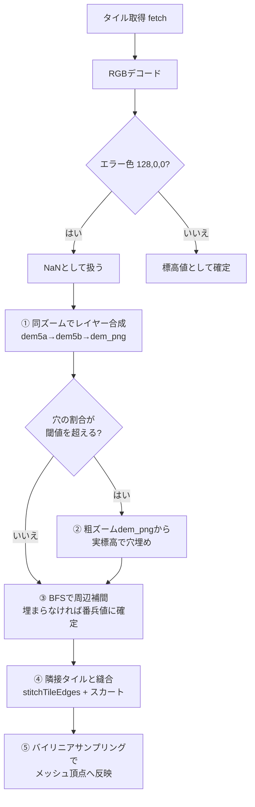
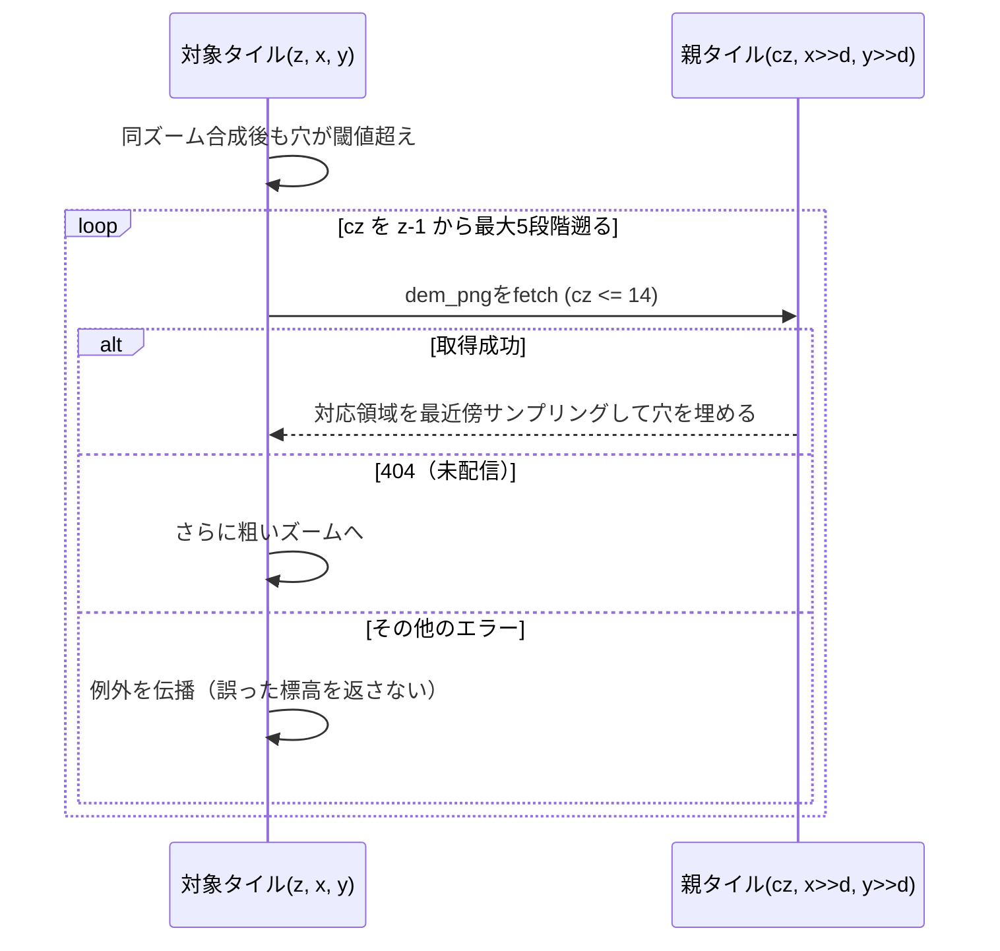
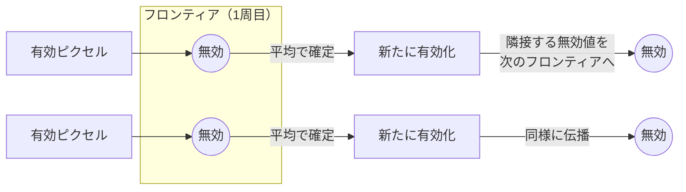
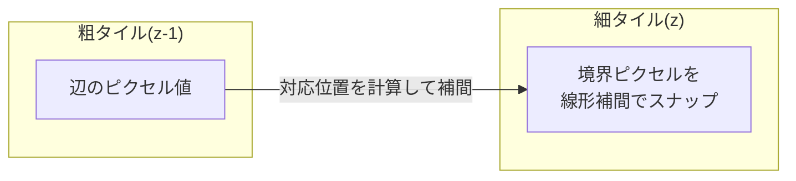
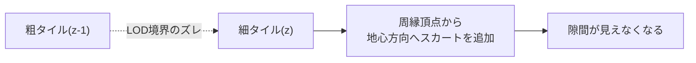

# はじめに

jpmap_terrainについては、こちらの記事で紹介しています。

https://qiita.com/8ga3/items/33c1b135fcebd3ec8107

地理院タイルの標高タイル（DEM: dem5a / dem5b / dem_png）を使って3D地形を作っていると、必ずぶつかる問題があります。それが「**穴（no-data）**」です。

海面・湖・山岳の未整備エリアなど、地理院が標高を計測できていない場所は、タイル画像の中に「エラー値」として埋め込まれています。これをそのまま3Dメッシュに反映すると、地形がストンと凹んだり、逆にフラットな一枚岩になったりして、見た目がとても不自然になります。

この記事では、実際に自分が作っている地形ビューア（[jpmap_terrain](https://github.com/8ga3/jpmap_terrain)）で採用している、**穴を多段階でフォールバックしながら埋めていくアルゴリズム**を紹介します。ネタバレすると、以下のような5段構えです。



順番に見ていきましょう。

# 穴の正体：なぜno-dataになるのか

まず「そもそもなぜ標高が測れない場所があるのか」を軽く触れておきます。

地理院の高精度な標高データ（`dem5a`/`dem5b`）は、主に**航空レーザ測量**によって整備されています。これは飛行機から地上にレーザーパルスを照射し、反射して戻ってくるまでの時間から距離を測る方式です。ところが、この測量で使われる近赤外レーザーは水面でほとんど反射せず吸収されてしまうため、**河川・湖・海面・堀などの水域は正しく測れません**。都市部のDEM5できれいに標高が取れているエリアでも、川筋や堀の部分だけ穴が空いているのはこのためです。

もう一つの理由は、単純に**レーザ測量そのものが行われていないエリアがある**ことです。山岳地帯など整備の優先度が低い場所では、そもそも高精度なレーザ測量データが存在せず、より粗い解像度の`dem_png`（後述）でしかカバーされていません。

つまり穴が生まれる理由は大きく2つです。

- **水面**：レーザーが反射しないため、整備済みエリアの中にも局所的な穴ができる
- **未整備エリア**：山岳地帯などレーザ測量自体が行われていない広域

この2つの性質の違いが、後述する「同ズームでのレイヤー合成」と「粗ズームからの穴埋め」という2段階のフォールバックの設計に直結してきます。

## エラー色のデコード

地理院標高タイルはPNG画像で、RGBの3バイトを合成して標高値にデコードする仕様になっています。

```typescript
/** 地理院標高タイルのRGBデコード（無効値は NaN） */
export const decodeGsiElevation = (
    r: number,
    g: number,
    b: number
): number => {
    if (r === 128 && g === 0 && b === 0) return NaN;
    const raw = r * 65536 + g * 256 + b;
    return raw < 2 ** 23 ? raw * 0.01 : (raw - 2 ** 24) * 0.01;
};
```

ポイントは `r === 128 && g === 0 && b === 0` の部分です。この特定の色は「無効値（no-data）」を意味する取り決めになっていて、これを見つけたら `NaN` にデコードします。

さらにコード全体では、`NaN` と、もう一つの特別な値である `NO_DATA_SENTINEL`（**番兵値**、または**センチネル値**とも呼びます。値は`-100`）をまとめて「無効」として扱う関数を用意しています。

```typescript
export const NO_DATA_SENTINEL = -100;

/** NaN または NO_DATA_SENTINEL を「無効」とみなす */
export const isInvalidElev = (v: number): boolean =>
    Number.isNaN(v) || v === NO_DATA_SENTINEL;
```

`-100m` という値を番兵値に使っているのは地味に理由があって、実際の地形で `-100m` を下回ることは（海岸線の観測誤差程度を除けば）現実的にありえないからです。「本当に埋め残った場所」を後段の処理でも一意に判別できるようにしているわけですね。

以下は、穴だらけの標高データがどう見えるかのイメージです。


真ん中の画像の赤い部分が、エラー色からデコードされた `NaN`（無効値）の領域です。この赤い穴を、次の章から説明する手順で埋めていきます。

# ① 同ズームでのレイヤー合成（dem5a → dem5b → dem_png）

地理院の標高タイルには、実は解像度違いの複数レイヤーがあります。

| レイヤー | 解像度目安 | 特徴 |
| --- | --- | --- |
| `dem5a` | 1m格子 | 都市部中心に高精度だがカバレッジに大きな穴 |
| `dem5b` | 2m格子 | dem5aより広いがこれも穴がある |
| `dem_png` | 10m格子 | 全国整備済みでほぼ穴がないが、z14までしか配信されない |

厄介なのは、**山岳地帯では `dem5a` が HTTP 200 を返すのに、タイルの中身の大半が no-data ということがある**点です（前述の「未整備エリア」の典型例です）。ここで「200が返ってきたから採用」とナイーブに実装してしまうと、わずかに残った有効ピクセルが後段の補間処理でタイル全体に塗り広げられてしまい、本来の起伏を反映しない不自然な地形になってしまいます。

これを避けるため、実装では次のようにレイヤーを順番に取得し、ピクセル単位で穴だけを埋めていきます。

```typescript
for (const layer of DEM_LAYERS) {
    // 穴が閾値以下になれば以降のレイヤーは不要
    if (merged && holes <= total * COMPOSITE_HOLE_RATIO) break;

    // dem_pngはz14までしか配信されない
    if (layer === "dem_png" && zoom > DEM_PNG_MAX_ZOOM) continue;

    const img = await loadImageData(url);

    if (!merged) {
        // 最初のレイヤーをベースに採用
        merged = decodeAll(img);
    } else {
        // no-dataの穴だけを当レイヤーの有効値で埋める
        for (const idx of holes) {
            if (!Number.isNaN(decoded)) merged[idx] = decoded;
        }
    }
}
```

ここでの設計判断は2つあります。

1. **高解像度優先**：`dem5a` の有効ピクセルは絶対に上書きしない。穴になっているピクセルだけを次のレイヤーで補う。
2. **閾値を超えるまでは合成しない**：整備済みのDEM5でも、堀や河川・タイル境界などでわずかに（実測で2〜23%程度）穴が生じます。この程度の微小な穴のために毎回下位レイヤーを取りに行くと、無駄な通信が発生し、描画結果も微妙に変わってしまいます。そこで「穴がタイル全体の10%（`COMPOSITE_HOLE_RATIO`）を超えたときだけ」下位レイヤーを取得する、というコスト対効果を意識した閾値判定にしています。


# ② 粗ズームからの穴埋め（同ズームで埋まらない場合）

`dem_png` まで合成しても、まだ穴が閾値を超えて残るケースがあります。典型例は **z15以上のズームレベル**です。`dem_png` はz14までしか配信されないため、同じズームレベルには「穴を埋めるための実標高データ」がそもそも存在しません。

そこで登場するのが、**親タイル（さらに粗いズーム）からの穴埋め**です。



地理院の全DEMレイヤーは同一の256pxタイルスキームで座標が揃っている（co-registered）ため、親タイルの対応領域を最近傍でピクセル対応させるだけで、リサンプリングなしに穴を埋められます。

```typescript
const fillHolesFromCoarseDem = (
    merged: Float32Array,
    width: number,
    height: number,
    parent: ImageData,
    zoom: number,
    x: number,
    y: number,
    cz: number
): number => {
    const d = zoom - cz;
    const scale = 1 << d;
    // 対象タイルが親タイル内で占めるサブ領域を特定して、
    // 穴になっているピクセルだけ実標高で置き換える
    ...
};
```

遡れる段数には `COARSE_FILL_DEPTH = 5` という上限を設けています。無制限に遡ると通信コストが跳ね上がるので、「そこそこ荒い標高でもいいから実データで埋める」ことと「通信回数を抑える」ことのバランスを取った値です。


ここで重要なのが**エラーの種類の切り分け**です。

```typescript
} catch (e) {
    // 404（未配信）のみ次の粗ズームへ。一時障害（タイムアウト/ネットワーク/5xx等）は
    // 握りつぶさず伝播し、穴埋め未完のまま誤った標高を返さない。
    if (e instanceof TileFetchError && e.status === 404) continue;
    throw e;
}
```

「404だから次を試す」のと「タイムアウトだから諦める」を区別しているのがポイントです。404は「その領域にはそもそもデータが存在しない」という**確定的な情報**なので次の粗ズームに進んでよいのですが、タイムアウトや5xxエラーは「今回たまたま取れなかっただけ」で**一時的な障害**の可能性があります。ここを一緒くたにしてしまうと、本当は取得できたはずのデータを諦めて、間違った標高（穴埋め未完のまま）を返してしまうことになります。

# ③ 局所補間（BFSによるフロンティア方式）

レイヤー合成・粗ズーム穴埋めをやってもなお残る「微小な穴」は、周辺の有効ピクセルから補間します。ここで使われているのが**BFS（幅優先探索）のフロンティア方式**です。



やっていることはシンプルです。

1. まず「無効だけど、隣に有効なピクセルがある」ピクセルを集めて最初のフロンティアにする
2. フロンティアの各ピクセルについて、周囲8方向の有効な値だけを平均して確定させる
3. 新しく確定したピクセルの隣にまだ無効なピクセルがあれば、それを次のフロンティアに積む
4. フロンティアが空になるまで繰り返す

これは要するに「波紋が広がるように、外側の有効な標高から内側へじわじわ埋めていく」処理です。単純な全体平均で埋めるのではなく、**空間的に近い場所の値を優先して伝播させる**ことで、不自然な段差が生まれにくくなっています。

```typescript
while (frontier.length > 0) {
    const next: number[] = [];
    for (const idx of frontier) {
        if (!isInvalidElev(elev[idx])) continue; // 既に埋まった
        // 周囲8マスの有効値だけを平均
        const { sum, count } = averageValidNeighbors(elev, idx);
        if (count > 0) {
            elev[idx] = sum / count;
            // 新たに埋まったピクセルの隣の無効値を次のフロンティアへ
            pushNewlyInvalidNeighbors(next, elev, idx);
        }
    }
    frontier = next;
}
```

そして、**それでも埋められなかったピクセル**（＝タイル全体が無効だった場合など）は、冒頭で紹介した `NO_DATA_SENTINEL`（-100m）に確定させます。

```typescript
// 全ピクセル無効等で残った無効値はNO_DATA_SENTINELにフォールバック。
// 0にすると後段のisAllNaN判定で「有効」と誤認されてしまうため、
// センチネル値で残しておく。
for (let i = 0; i < size; i++) {
    if (Number.isNaN(elev[i])) elev[i] = NO_DATA_SENTINEL;
}
```

「0で埋めない」というのが地味に重要なポイントです。0mで埋めてしまうと、後で「このタイルは全部無効だった」と再判定したいときに、有効な標高（海抜0m）と区別がつかなくなってしまいます。番兵値（センチネル値）を使うことで、後から再取得・再フィルが走ったときにも「ここはまだ埋め切れていない」と正しく識別できるようにしているわけです。

# ④ タイル境界の縫い合わせ

ここまでの処理は1枚のタイルの中で完結する話でしたが、実際の地形は複数のタイルを敷き詰めて表示するので、**タイルの境界（辺・角）がズレていると亀裂（クラック）が見えてしまいます**。これは各タイルが独立にBFS補間される以上、避けられないズレです。同じ地形の続きでも、タイルAとタイルBでそれぞれ別々に周辺の有効値から推定するため、境界のすぐ内側で推定結果がわずかに食い違うことがあります。

そこで、隣接タイルと標高値をすり合わせる処理が入ります。同じズームレベルの隣接タイル同士は、境界のピクセルを平均化します。

```typescript
// 上辺: target row=0 ↔ top row=last
if (neighbors.top) {
    for (let col = 1; col < last; col++) {
        const avg = nanMean([target[tIdx], neighbors.top[nIdx]]);
        if (!Number.isNaN(avg)) target[tIdx] = avg;
    }
}
```

`nanMean` は無効値を平均計算から除外する関数で、「両方とも無効なら変更しない」「片方だけ無効ならもう片方をそのまま採用する」という安全策になっています。角（4タイルが接する点）も同様に、最大4タイル分の平均を取ります。

処理前後でどう変わるかを、断面のグラフと合わせて見てみましょう。


左側（処理前）は境界のすぐ左右で標高値が独立に推定されているため、断面グラフを見ると明確な段差（ジャンプ）が生じています。右側（処理後）は境界の1列を平均化した結果、値が滑らかに連続しているのがわかります。同じ状況を3Dサーフェスで見ると、段差が「崖」のように見えていたのが縫い合わせで解消される様子がより直感的にわかります（3D図は視認性のため段差を誇張しています）。


さらに、ズームレベルが異なるタイル同士が隣接する場合（LODの境界）には、境界にT字型の隙間（T-junction）ができてしまうので、粗いタイル側の辺を線形補間して細かいタイル側にスナップさせる処理（`stitchTileEdgesCrossLevel`）も用意されています。



## それでも残る隙間は「スカート」で隠す

ここまでの縫い合わせ処理でほとんどの境界は連続しますが、遠くのタイルとの間や、LOD境界のズレが大きい場合など、それでも微妙な隙間が残ることがあります。この最後の隙間対策として、タイルの周縁の頂点から**地心方向へ垂直な壁（スカート）を垂らして、隙間を物理的に隠してしまう**という手法が使われています。Cesium や Google Earth などの地形レンダラーでも標準的に使われている方式です。



概念図としてまとめると、次のようになります。


粗タイルと細タイルの地表面の間にわずかなズレ（T字クラック）があっても、細タイルの縁から下に垂らした壁（スカート）がそのズレを覆い隠してくれるので、見た目には破綻が見えなくなります。（※図では分かりやすさのため、実際よりもズレを大きく誇張して描いています）

これは概念図だけでなく、実際に`jpmap_terrain`のBabylon.js実装で確認できます。スカート生成を一時的に無効化し、富士山頂付近を航空写真テクスチャで表示してみると、次のように斜面上にクラックがはっきり見えました。


上（スカート無効化）は斜面に白い破線状のクラックが写っていますが、下（スカート有効・既定の実装）ではこのクラックが完全に隠れて滑らかな斜面に見えます。「境界を完全に一致させる」のではなく「見えなければOK」という割り切った解決策ですが、リアルタイムレンダリングの地形表示では広く使われている実用的なテクニックだということが、実機でもよくわかります。

# ⑤ サンプリング時にも無効値を除外する

最後に、メッシュの頂点座標に標高を割り当てる段階（バイリニアサンプリング）でも、無効値の扱いに気を配っています。

```typescript
export const sampleElevBilinear = (
    elev: Float32Array,
    px: number,
    py: number,
): number => {
    // ...4隅の座標を求めたあと
    let wSum = 0;
    let valSum = 0;
    const addCorner = (x: number, y: number, w: number): void => {
        const v = elev[y * TILE_SIZE + x];
        if (!isInvalidElev(v) && Number.isFinite(v)) {
            wSum += w;
            valSum += w * v;
        }
    };
    addCorner(x0, y0, (1 - fx) * (1 - fy));
    addCorner(x1, y0, fx * (1 - fy));
    addCorner(x0, y1, (1 - fx) * fy);
    addCorner(x1, y1, fx * fy);

    return wSum > 0 ? valSum / wSum : 0;
};
```

普通にバイリニア補間をすると、4隅の重みをそのまま使って加重平均を取りますが、ここでは**無効な隅だけ重みから除外して、残った有効な隅だけで正規化**しています。NaNを0として混ぜてしまうと、湖面や欠測境界のように4隅の一部だけ無効な場所で結果が0側に強く引っ張られ、不自然に沈んでしまうため、これを避けるための工夫です。

# まとめ：なぜここまで多段にするのか

振り返ると、この実装は次の5段構えでした。

1. **同ズームでのレイヤー合成**（高解像度優先、穴が閾値を超えたときだけ下位レイヤー取得）
2. **粗ズームからの穴埋め**（404と一時障害を区別しつつ、実標高で埋める）
3. **BFSによる局所補間**（空間的に近い有効値から波状に埋める。埋まらなければ番兵値（センチネル値）へフォールバック）
4. **タイル境界の縫い合わせ＋スカート**（複数タイルをまたいだ整合性、LOD境界の隙間隠し）
5. **サンプリング時の無効値除外**（バイリニア補間で無効な隅を重みから除外）

一見やりすぎにも見えますが、それぞれの段階には「これをやらないとどう壊れるか」という具体的な理由（地形のフラット化、標高の大きなズレ、タイル間のクラックなど）が対応しています。地理院タイルのような**現実の地理データを扱うプロダクトコード**では、こういう「地味だけど効く」フォールバックの積み重ねが、最終的な見た目の品質を大きく左右するのだなと実感しました。

もし地理院タイルや標高データを使った3D表示を作る機会があれば、ぜひ参考にしてみてください。

---

**参考**
- 実装リポジトリ: [8ga3/jpmap_terrain](https://github.com/8ga3/jpmap_terrain)
- 地理院タイル（標高タイル）仕様: https://maps.gsi.go.jp/development/ichiran.html
